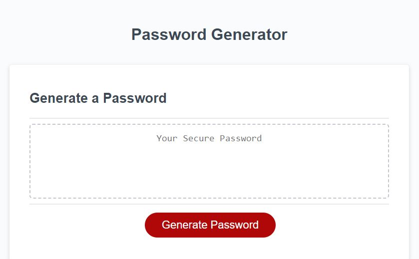
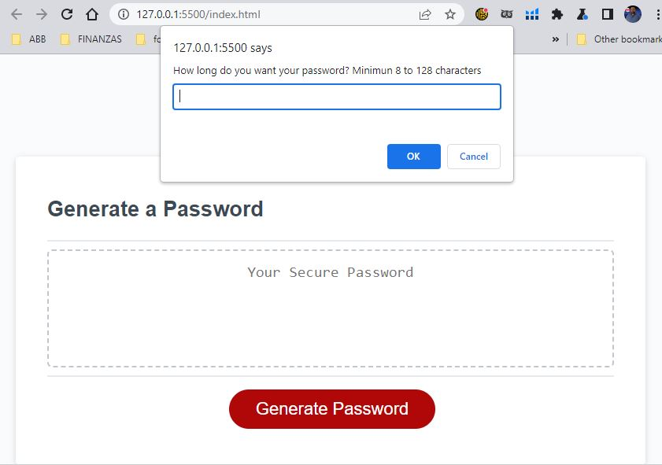
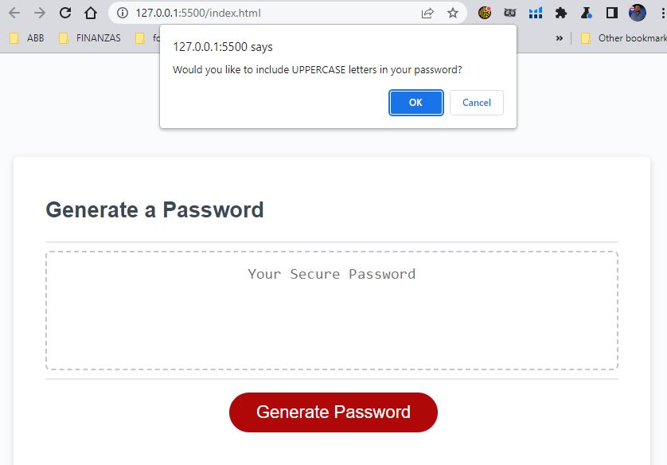
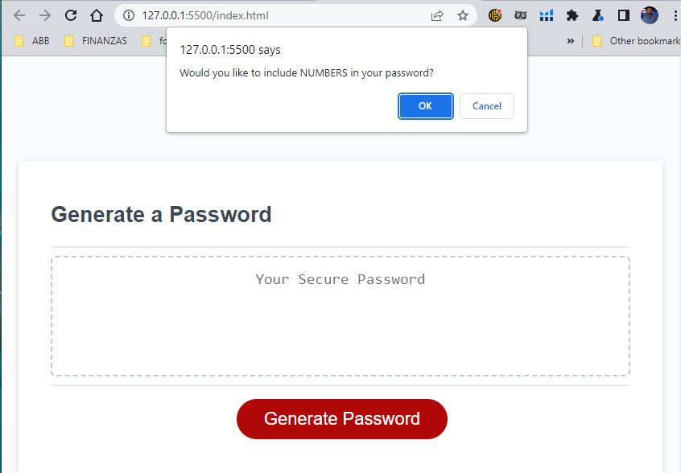
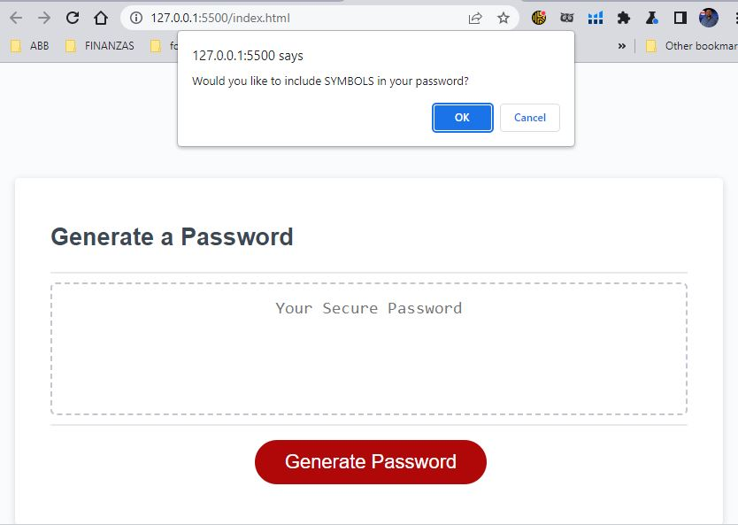

# Password Generator

## Description

This website has been created to add a web application that will generate a random password given some minimum properties choose by the user.

## Installation

N/A

## Usage

To use this page simply the user will receive some prompt asking:

- How many characthers from 8 to 128 wants to use.
- if the user wants to use Lowecae, Uppercase, Numbers and Symbols. at least one type of character must be selected.
- Then the page will show a generated password with all the requirements selected by the user.

This generator can be run over an over as much as user wants it.

The deployment application link is https://gmontano79.github.io/passwordgenerator/

Here are the screenshot for the prompts that user will get once the Generate PAssword is clicked:

### Genral view of the page:

### Prompt asking for how many characters the password must have.

### Promp adking if user want the password to have Lowercase:

### Promp adking if user want the password to have Uppercase:

### Promp adking if user want the password to have Numbers:

### Promp adking if user want the password to have Symbols:

### Pasword generated is shown at the page:

### Error alert when not a number is input by the user:

### Error alert shown the impust was not a number:

## Credits

N/A

## License

Please refer to the LICENSE in the repo.
